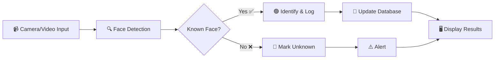

<div align="center">

# 🎯 AI Smart Surveillance & Face Recognition System

[](https://github.com/Harshathmukundan/AI-Smart-Surveillance-Face-Recognition/actions)
[](https://opensource.org/licenses/MIT)
[](https://www.python.org/)
[](https://opencv.org/)
[](https://github.com/Harshathmukundan/AI-Smart-Surveillance-Face-Recognition/releases)
[](https://github.com/Harshathmukundan/AI-Smart-Surveillance-Face-Recognition/releases)
[](https://github.com/Harshathmukundan/AI-Smart-Surveillance-Face-Recognition/discussions)

[](https://github.com/Harshathmukundan/AI-Smart-Surveillance-Face-Recognition/stargazers)
[](https://github.com/Harshathmukundan/AI-Smart-Surveillance-Face-Recognition/network)
[](https://github.com/Harshathmukundan/AI-Smart-Surveillance-Face-Recognition/issues)
[](https://github.com/Harshathmukundan/AI-Smart-Surveillance-Face-Recognition/pulls)

[](https://github.com/Harshathmukundan/AI-Smart-Surveillance-Face-Recognition/commits)
[](https://github.com/Harshathmukundan/AI-Smart-Surveillance-Face-Recognition)
[](https://github.com/Harshathmukundan/AI-Smart-Surveillance-Face-Recognition/graphs/contributors)

[](https://github.com/Harshathmukundan/AI-Smart-Surveillance-Face-Recognition)
[](https://github.com/Harshathmukundan/AI-Smart-Surveillance-Face-Recognition/pulls)
[](https://github.com/Harshathmukundan)

---

### 🛠️ Built With


---

### 📊 GitHub Stats


</div>

---

## 📖 About

A real-time **AI-powered surveillance system** that uses **facial recognition** to identify and track individuals across multiple CCTV cameras. Built with Python, OpenCV, and the `face_recognition` library.

### 🎯 Key Features

| Feature | Description |
|---------|-------------|
| 🔍 **Real-time Face Detection** | Detect and identify faces from live camera feeds or video files |
| 📊 **Database Tracking** | Maintain records of identified individuals with timestamps and locations |
| 🖥️ **GUI Interface** | User-friendly Tkinter GUI for face registration and management |
| 🎥 **Multi-source Input** | Support for live cameras and pre-recorded video files |
| 🟢 **Visual Indicators** | Green boxes for known faces, red for unknown — with name labels |
| 🔐 **Criminal Database Integration** | Can be integrated with national criminal databases for enhanced security |

---

## 🚀 Quick Start

### Prerequisites

- Python 3.9+
- Webcam (for live detection) or video files

### Installation

```bash
# Clone the repository
git clone https://github.com/Harshathmukundan/AI-Smart-Surveillance-Face-Recognition.git
cd AI-Smart-Surveillance-Face-Recognition

# Create virtual environment
python -m venv venv
source venv/bin/activate  # On Windows: venv\Scripts\activate

# Install dependencies
pip install -r requirements.txt
```

### Usage

#### 🖥️ GUI Mode (Face Registration + Surveillance)
```bash
python gui.py
```

#### 📹 Camera Mode (Direct Surveillance)
```bash
# Use default camera
python main.py

# Use a specific video file
python main.py --video path/to/video.mp4
```

#### 🔎 Tracking Mode
```bash
python Track.py
```

---

## 📁 Project Structure

```
AI-Smart-Surveillance-Face-Recognition/
├── 📄 main.py              # Core surveillance engine with face detection
├── 🖥️ gui.py               # Tkinter GUI for face registration
├── 🧠 simple_facerec.py    # Face encoding & recognition module
├── 🗃️ data_handling.py     # Database operations
├── 🔎 Track.py             # Tracking functionality
├── 🖼️ images/              # Stored face images for recognition
├── 💾 data.db              # SQLite database for user records
├── ⚙️ .github/workflows/   # CI/CD pipeline
├── 📋 requirements.txt     # Python dependencies
├── 📄 LICENSE              # MIT License
├── 🤝 CONTRIBUTING.md      # Contribution guidelines
└── 📖 README.md            # You are here!
```

---

## 🔧 How It Works



1. **Capture** — Video frames are captured from camera or video file
2. **Detect** — Faces are detected using the `face_recognition` library
3. **Recognize** — Detected faces are compared against stored encodings
4. **Track** — Recognized individuals are logged with location and timestamp
5. **Display** — Results are shown with color-coded bounding boxes

---

## 🤝 Contributing

Contributions are welcome! Please read our [Contributing Guidelines](CONTRIBUTING.md) for details.

1. Fork the Project
2. Create your Feature Branch (`git checkout -b feature/AmazingFeature`)
3. Commit your Changes (`git commit -m 'Add some AmazingFeature'`)
4. Push to the Branch (`git push origin feature/AmazingFeature`)
5. Open a Pull Request

---

## 📄 License

This project is licensed under the **MIT License** — see the [LICENSE](LICENSE) file for details.

---

## 👤 Author

<a href="https://github.com/Harshathmukundan">
  
</a>

---

<div align="center">

### ⭐ If you found this project useful, please give it a star!

[](https://github.com/Harshathmukundan/AI-Smart-Surveillance-Face-Recognition)

</div>
